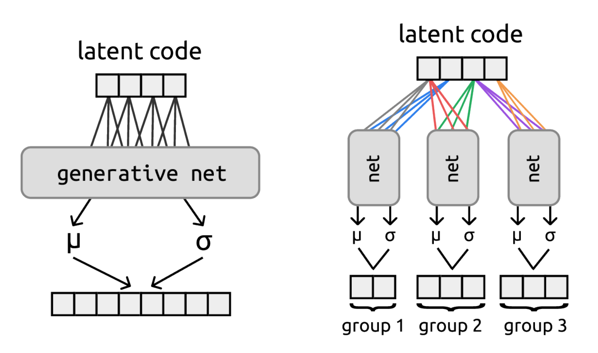

# oi-vae

Code for "oi-VAE: Output Interpretable VAEs for Nonlinear Group Factor Analysis" by [Samuel Ainsworth](http://samlikes.pizza), [Nick Foti](https://nfoti.github.io/), [Adrian K.C. Lee](https://depts.washington.edu/labsn/People/Lee/lee.html), and [Emily Fox](https://homes.cs.washington.edu/~ebfox/) presented at ICML 2018.

http://proceedings.mlr.press/v80/ainsworth18a/ainsworth18a.pdf

## Usage

Each of the files in the root of the project is a script to run one of the experiments in the paper, eg. `bars_data_oivae.py` runs the bars experiment and `mo_mo_mocap_oivae.py` runs the CMU Mocap data experiment. They all rely on the library code in the `lib/` folder which contains code generally useful across multiple scripts. In particular the exciting parts live here: https://github.com/samuela/oi-vae/blob/master/lib/oivae.py. In terms of getting started, the best entrypoint is `bars_data_oivae.py` since it’s the simplest example and doesn’t require downloading any datasets.

Note that this code was written back when PyTorch v0.3 was the latest version, and things have changed quite a bit since then, so you’ll probably need to use PyTorch v0.3 in order to get things to work.
